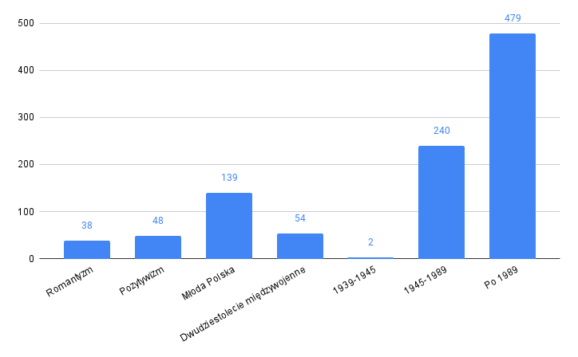

# Corpus of Literary Discourse (Korpus Dyskursu Literaturoznawczego; KDL)


The Corpus of Literary Discourse (KDL) is a collection of texts covering Polish literary discourse of the 19th and 20th centuries (1822-2022). It collects the works of Polish literary scholars who wrote during the last two hundred years. By design, the KDL is a monitoring corpus, thus reflecting changes in literary discourse through updates with new texts. All published texts are open-access.

## Contributors

**Institute of Literary Research of the Polish Academy of Sciences**, [www.ibl.waw.pl](https://ibl.waw.pl/)

## Corpus design
The collected texts come from different sources.
- subcorpus of anthologies (program texts, criticism, and literary theory), 
- subcorpus of literary persons (selections of writings), 
- subcorpus of periodicals, 
- subcorpus of monographs.

### Balancing criteria

The subcorpus of selected texts, in order to best represent the entire collection, was selected according to the following methodology. First, only documents that are only available in OpenAccess were selected as candidates for the corpus. Then, due to the small number of texts available in OpenAccess and written before 1945, all texts meeting this criterion were included in the corpus. Since we set the corpus size at 1000, and the total number of texts written before 1945 was 281, we were left with 719 texts of two literary eras to complete. Due to the overwhelming dominance of texts after 1989, we assumed that we would keep the overall ratio of texts from 1945-1989 as in the entire collection, and supplement the rest with texts from the years after 1989.

At the same time, we also prepared selection weights for these texts related to the gender distribution of the authors. We tried to keep the distribution consistent with the entire collection in terms of three possible values -- Male, Female, NA -- taking into account multi-authorship. The selection weights consisted of dividing the number of unknown authors by the number of male authors, dividing the number of female authors by the number of male authors (in the absence of male authors, it was the corresponding number of unknown or female authors), and summing these two values and the number of male authors divided by 2 (a parameter chosen experimentally based on the similarity of the distribution between the final created corpus and the entire collection).

### Limitations

- imprecise definition of the population – there is no complete list of publications in the field of literary studies, and the lists that can be compiled from available bibliographic data are not exhaustive
- uneven availability of publications in digital form – in particular, there is little availability of texts published between 1920 and 1990
- copyright – licenses prevent the use of particular texts in corpus work

### Statistics

The corpus contains 13,949, most of which are post-1989 texts. The corpus still needs to be balanced.

<p align="center">
  
</p>

The balanced and publicly available corpus contains 1000 texts.

<p align="center">
  
</p>

## Access

The corpus is published in this GitHub repository as a set of .txt files in two .zip files: [here](https://github.com/CHC-Computations/Korpus-Dyskursu-Literaturoznawczego/blob/main/KDL_txt_1_of_2.zip) and [here](https://github.com/CHC-Computations/Korpus-Dyskursu-Literaturoznawczego/blob/main/KDL_txt_2_of_2.zip).

### Metadata

The description of the corpus texts includes the following metadata:
```
identifier
type
title
author
author_gender
source
source_number
source_place
source_date
publication_date
publication_place
pages
literary epoch
decade
```
The table with metadata is presented [here](https://github.com/CHC-Computations/Korpus-Dyskursu-Literaturoznawczego/blob/main/KDL_resources.csv).

## Use in the [GoLEM service](https://chrc.clarin-pl.eu/files/golem)

Graph Literary Machine Explorer (GoLEM) is a system for advanced analysis and visualization of the connections between terms, entities, and vocabularies (topics) in scientific texts, primarily in texts in the field of literary studies, in synchronous and diachronic dimensions.
GoLEM will offer the possibility to work on ready-made corpora or corpora uploaded by the user. A KDL will be made available as part of the service.
The following services are envisaged:
- Entity analysis: entity recognition and time-varying frequency analysis, analysis of relationships between entities in selected textual wholes (sentence, paragraph, whole document, user-defined window) and between texts or sub-corpus highlighted based on metadata; the processing pipeline will include separation of footnotes and bibliography, recognition of correlations, NEDs, and NELs (disambiguation of names of people and places)
- Analysis of terms/concepts: recognition of literary and literature terms (eventually also terms from other disciplines) and analysis of their frequency of occurrence in the corpus, in individual texts and sub-corpus taking into account changes over time, analysis of changes in the meaning of terms over time and within different sub-corpus
- Vocabulary analysis: semi-supervised topic modeling, LDA including literary entities and terms, "contextualized" topic modeling using language models.

## Licence

All texts in this collection are in the public domain. No rights reserved, texts are available under Creative Commons Attribution 4.0 International Licence [CC BY 4.0](https://creativecommons.org/licenses/by/4.0/).


