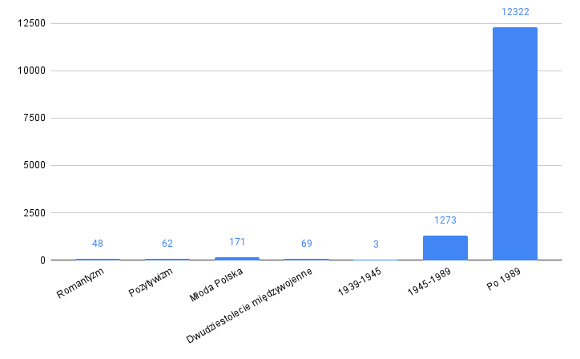

# Corpus of Literary Discourse (Korpus Dyskursu Literaturoznawczego; KDL)

The Corpus of Literary Discourse (KDL) is a collection of texts covering Polish literary discourse of the 19th and 20th centuries (1822-2022). It collects the works of Polish literary scholars who wrote during the last two hundred years. By design, the KDL is a monitoring corpus, thus reflecting changes in literary discourse through updates with new texts. All published texts are open-access.

## Contributors

**Institute of Literary Research of the Polish Academy of Sciences**, [www.ibl.waw.pl](https://ibl.waw.pl/)

## Corpus design
The collected texts come from different sources.
- subcorpus of anthologies (program texts, criticism, and literary theory), 
- subcorpus of literary persons (selections of writings), 
- subcorpus of periodicals, 
- subcorpus of monographs.

### Balancing criteria

- literary era (or sub-period), 
- branch of literary studies (history, criticism, theory), 
- length of text, current of literary studies (e.g., structuralism, deconstruction), 
- place of publication (e.g., Lviv, Krakow, Warsaw), 
- gender of the author, 
- reception (number of reprints, citations, mentions in syllabuses).

Each criterion will be assigned a minimum and maximum value for the percentage of texts from each pool (e.g., a minimum of 20% of critical-literary texts, but no more than 33%), then we will determine the proportions for each period, taking into account the unevenness of production (e.g., a minimum of 5% and a maximum of 65% of titles from a given period should have a female author) - we will use expert consultation in determining the proportions.

### Limitations

- imprecise definition of the population – there is no complete list of publications in the field of literary studies, and the lists that can be compiled from available bibliographic data are not exhaustive
- uneven availability of publications in digital form – in particular, there is little availability of texts published between 1920 and 1990
- copyright – licenses prevent the use of particular texts in corpus work

### Statistics

The corpus contains xxx, most of which are post-1989 texts. The corpus still needs to be balanced.

<p align="center">
  
</p>

## Access

The corpus will be published in this GitHub repository soon as a set of .txt files.

### Metadata

The description of the corpus texts includes the following metadata:
```
identifier
type
title
author
author_gender
source
source_number
source_place
source_date
publication_date
publication_place
pages
```
The table with metadata is presented [here](https://github.com/CHC-Computations/Korpus-Dyskursu-Literaturoznawczego/blob/main/KDL_resources.xlsx).

## Use in the [GoLEM service](https://chrc.clarin-pl.eu/files/golem)

Graph Literary Machine Explorer (GoLEM) is a system for advanced analysis and visualization of the connections between terms, entities, and vocabularies (topics) in scientific texts, primarily in texts in the field of literary studies, in synchronous and diachronic dimensions.
GoLEM will offer the possibility to work on ready-made corpora or corpora uploaded by the user. A KDL will be made available as part of the service.
The following services are envisaged:
- Entity analysis: entity recognition and time-varying frequency analysis, analysis of relationships between entities in selected textual wholes (sentence, paragraph, whole document, user-defined window) and between texts or sub-corpus highlighted based on metadata; the processing pipeline will include separation of footnotes and bibliography, recognition of correlations, NEDs, and NELs (disambiguation of names of people and places)
- Analysis of terms/concepts: recognition of literary and literature terms (eventually also terms from other disciplines) and analysis of their frequency of occurrence in the corpus, in individual texts and sub-corpus taking into account changes over time, analysis of changes in the meaning of terms over time and within different sub-corpus
- Vocabulary analysis: semi-supervised topic modeling, LDA including literary entities and terms, "contextualized" topic modeling using language models.


